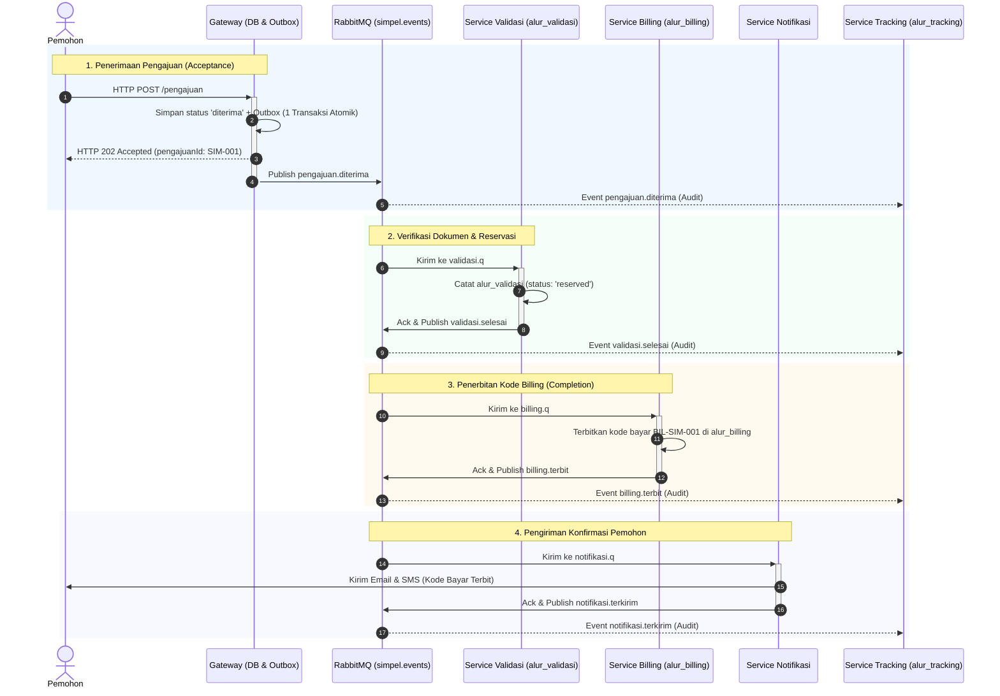

# Lab 2 — Contoh Lembar Desain Integrasi SIMPEL (Cetak Biru Terisi)

**Nama Kelompok:** Kelompok 1 — Tim Arsitektur Integrasi SIMPEL  
**Anggota Tim:** Budi (Fasilitator), Siti (Pencatat), Ahmad (Penantang), Rian (Penyaji)  
**Tanggal Pelaksanaan:** 15 September 2026 (PJJ Message Broker TA 2026)  
**Tautan Implementasi:** Selaras dengan kode `simpel-lab/layanan/alur.js` & `messaging.js` (MP-06 s.d. MP-08)

---

### 1. Kebutuhan Bisnis & Janji Layanan
* **Kapan pengajuan dinyatakan DITERIMA (*accepted*)?**  
  Pengajuan dinyatakan diterima saat format request HTTP tervalidasi dasar, data pengajuan tersimpan secara durable di tabel database lokal Gateway (`pengajuan`, status `'diterima'`), dan event `pengajuan.diterima` dicatat di tabel Outbox dalam satu transaksi database lokal yang sama (Transactional Outbox).  
  *Bukti untuk Pemohon:* Respons **HTTP 202 Accepted** dengan payload `{"status":"diterima","pengajuanId":"SIM-001","trackingUrl":"/pengajuan/SIM-001/status"}`.
* **Kapan seluruh proses dinyatakan SELESAI (*completed*)?**  
  Proses dinyatakan selesai saat Service Billing berhasil menerbitkan kode pembayaran perizinan (`BIL-SIM-001`), menyimpannya di tabel database `alur_billing`, dan mem-publish event `billing.terbit`. Service Billing adalah pemilik (*owner*) status akhir penyelesaian transaksi tahap perizinan ini.
* **Batas toleransi penundaan (*tolerable delay*) & persistensi data:**  
  Toleransi latensi verifikasi berkas ≤ 5 detik; penerbitan billing ≤ 15 detik (saat lonjakan beban ≤ 2 menit). Seluruh antrean dideklarasikan `durable: true` dan pesan dikirim dengan flag `persistent: true` (delivery_mode = 2) untuk menjamin nol kehilangan data saat broker restart.

---

### 2. Diagram Alur Data & Kepemilikan State

#### A. Diagram Urutan Interaksi & Siklus Hidup Pesan (Sequence Diagram)



#### B. Diagram Topologi Pipeline Layanan (Pipeline Architecture)

```mermaid
flowchart LR
    subgraph S1 ["1. Penerimaan"]
        direction TB
        P["Pemohon"] -->|"POST /pengajuan"| GW["Service Gateway<br/>(DB & Outbox)"]
        GW -.->|"HTTP 202 Accepted"| P
    end

    subgraph S2 ["2. Validasi"]
        direction TB
        QV[("Queue:<br/>validasi.q")] -->|"consume & ack"| SV["Service Validasi<br/>(DB: alur_validasi)"]
    end

    subgraph S3 ["3. Billing"]
        direction TB
        QB[("Queue:<br/>billing.q")] -->|"consume & ack"| SB["Service Billing<br/>(DB: alur_billing)"]
    end

    subgraph S4 ["4. Notifikasi"]
        direction TB
        QN[("Queue:<br/>notifikasi.q")] -->|"consume & ack"| SN["Service Notifikasi<br/>(Kirim Email/SMS)"]
    end

    subgraph S5 ["Audit Trail (Async)"]
        direction TB
        QT[("Queue: tracking.q")] --> ST["Service Tracking<br/>(DB: alur_tracking)"]
    end

    subgraph S6 ["Karantina Cacat"]
        direction TB
        QDLQ[("DLQ: pengajuan.invalid")]
    end

    %% Alur Normal Pipeline
    GW ==>|"rk: pengajuan.diterima"| QV
    SV ==>|"rk: validasi.selesai"| QB
    SB ==>|"rk: billing.terbit"| QN

    %% Audit Wildcard (#)
    GW -.->|"audit (#)"| QT
    SV -.->|"audit (#)"| QT
    SB -.->|"audit (#)"| QT
    SN -.->|"audit (#)"| QT

    %% Failure / Reject
    SV -.->|"Reject (cacat)"| QDLQ
    SB -.->|"Kompensasi (billing.gagal)"| QV

    classDef stage fill:#F8FAFC,stroke:#94A3B8,stroke-width:1px;
    classDef comp fill:#EEF2F7,stroke:#192A56,stroke-width:1.5px,color:#192A56;
    classDef queue fill:#ECFDF5,stroke:#047857,stroke-width:1.5px,color:#065F46;
    classDef dlq fill:#FEE2E2,stroke:#B91C1C,stroke-width:1.5px,color:#991B1B;

    class S1,S2,S3,S4,S5,S6 stage;
    class GW,SV,SB,SN,ST comp;
    class QV,QB,QN,QT queue;
    class QDLQ dlq;
```



**Penjelasan Alur & Kepemilikan State:**
1. **Happy Path (Alur Normal):**
   * **Pemohon → Gateway:** Mengirim request HTTP POST pengajuan. Gateway menyimpan berkas pengajuan ke tabel `pengajuan` dan mencatat event di tabel Outbox dalam 1 transaksi database lokal atomik.
   * **Gateway → Pemohon:** Mengembalikan respons cepat `HTTP 202 Accepted` bersama nomor pendaftaran `pengajuanId: "SIM-001"` dan URL pelacakan. Gateway kemudian me-relay event ke `simpel.events` dengan routing key `pengajuan.diterima`.
   * **Validasi Service:** Mengambil pesan dari `validasi.q`, mencatat status verifikasi di `alur_validasi (status: 'reserved')`, lalu mem-publish event `validasi.selesai`.
   * **Billing Service:** Mengambil pesan dari `billing.q`, menerbitkan kode pembayaran di `alur_billing ('BIL-SIM-001')`, lalu mem-publish event `billing.terbit`.
   * **Notifikasi Service:** Mengambil pesan dari `notifikasi.q`, mengirimkan konfirmasi email/SMS pemohon, dan mencatatnya di `alur_notifikasi`.
   * **Tracking Service:** Mengambil seluruh event dari `tracking.q` via wildcard binding `#` dan mencatat kronologi lengkap di `alur_tracking`.
2. **Alur Kegagalan & Kompensasi (Saga Pattern):**
   * **Validasi Gagal Bisnis:** Service Validasi mem-publish event `pengajuan.ditolak` (hanya masuk ke `tracking.q` dan `notifikasi.q`, tidak diteruskan ke `billing.q`).
   * **Billing Gagal / Timeout:** Service Billing mem-publish event `billing.gagal`. Event ini diterima kembali oleh `validasi.q`. Service Validasi mengeksekusi aksi kompensasi: membatalkan reservasi di `alur_validasi` (mengubah status `'reserved'` menjadi `'cancelled'`), lalu mem-publish event `pengajuan.dibatalkan`.


---

### 3. Tabel Topologi Routing (Topic Exchange `simpel.events`)

| Nama Event Bisnis | Exchange & Tipe | Routing / Binding Key | Queue Tujuan → Consumer | Peran Pemrosesan |
|---|---|---|---|---|
| `pengajuan.diterima` | `simpel.events` (topic) | `pengajuan.diterima` | `validasi.q` → Service Validasi | Validasi kelayakan dokumen dan perizinan |
| `validasi.selesai` | `simpel.events` (topic) | `validasi.selesai` | `billing.q` → Service Billing | Penerbitan kode pembayaran billing |
| `billing.terbit` | `simpel.events` (topic) | `billing.terbit` | `notifikasi.q` → Service Notifikasi | Pengiriman notifikasi email/SMS ke pemohon |
| `pengajuan.#` | `simpel.events` (topic) | `pengajuan.#` | `tracking.q` → Service Tracking | Audit trail log siklus hidup pengajuan |
| `billing.#` | `simpel.events` (topic) | `billing.#` | `tracking.q` → Service Tracking | Audit trail penerbitan & kegagalan billing |
| `billing.gagal` | `simpel.events` (topic) | `billing.gagal` | `validasi.q` → Service Validasi | Kompensasi Saga: pembatalan reservasi izin |
| `*` (pesan rusak) | `simpel.invalid` (direct) | `invalid` | `pengajuan.invalid` (DLQ) | Karantina pesan cacat skema untuk investigasi |

---

### 4. Spesifikasi Kontrak Event Minimum (Envelope JSON)

Berikut adalah contoh kontrak event `pengajuan.valid` / `validasi.selesai` yang digunakan pada `messaging.js`:

```json
{
  "event": "validasi.selesai",
  "schemaVersion": 1,
  "messageId": "evt-7f8a9b0c-1234-4567-89ab-cdef01234567",
  "correlationId": "corr-SIM-001-20260915",
  "occurredAt": "2026-09-15T08:30:00.000Z",
  "data": {
    "pengajuanId": "SIM-001",
    "pemohon": "PT Maju Bersama",
    "jenis": "SIUP",
    "kantor": "KPP-Jakarta",
    "hasilValidasi": "lengkap",
    "petugas": "petugas-04"
  }
}
```

* **Aturan ID & Pelacakan:**
  * `messageId`: Wajib unik untuk setiap publikasi pesan baru (digunakan sebagai kunci idempotensi di consumer). Saat terjadi *retry*, `messageId` tidak boleh berubah agar worker mengenali duplikasi.
  * `correlationId`: Mengikat seluruh alur pesan dari Gateway sampai Notifikasi, dipetakan ke header AMQP `correlation_id` untuk observabilitas end-to-end.
* **Kebijakan Skema Invalid:**
  * Jika consumer menerima pesan dengan `schemaVersion` tidak didukung atau field wajib kosong: consumer menolak dengan `channel.reject(msg, false)`. Antrean dilengkapi konfigurasi `x-dead-letter-exchange: "simpel.invalid"` dan `x-dead-letter-routing-key: "invalid"`, sehingga pesan cacat langsung diisolasi ke antrean `pengajuan.invalid` tanpa menyumbat worker.

---

### 5. Pengujian Skenario Gangguan (Break Testing)

| Skenario Gangguan | Dampak Desain & Penanganan Teknis | Perilaku terhadap Pemohon / Status | Pemilik Pemulihan & Bukti |
|---|---|---|---|
| **1. Service Billing Down 10 Menit** | Pesan `validasi.selesai` tetap tersimpan aman di `billing.q` yang durable. Tidak ada pesan yang drop. Saat billing hidup kembali, worker memproses tumpukan pesan secara berurutan sesuai kapasitas prefetch. | Pemohon membuka URL tracking `/pengajuan/SIM-001/status` dan melihat status `"Menunggu Penerbitan Kode Billing"`. Tidak ada HTTP 504 Gateway Timeout. | **Pemilik:** Admin Billing & SRE.<br/>**Bukti:** Grafik antrean `billing.q` di Prometheus naik selama 10 menit, lalu surut ke nol setelah worker hidup kembali tanpa ada data hilang. |
| **2. Notifikasi Lambat (3 detik/pesan)** | `notifikasi.q` terisolasi secara independen dari alur utama. Lonjakan antrean di `notifikasi.q` tidak membebani `billing.q` maupun `validasi.q`. | Status izin dan kode billing pemohon sudah terbit secara sah di sistem. Hanya pengiriman email pengingat yang mengalami sedikit penundaan (*eventual delivery*). | **Pemilik:** Tim Notifikasi.<br/>**Bukti:** Billing selesai dalam ≤ 1 detik; log pengiriman email bertahap memproses antrean notifikasi tanpa error. |
| **3. Worker Crash Sebelum Kirim Ack (Duplikat)** | Broker melakukan *redelivery* pesan yang sama ke worker lain (`redelivered: true`). Worker menggunakan tabel deduplikasi `alur_inbox (owner, message_id)`. Transaksi database kedua dibatalkan via advisory lock / unique constraint `pengajuan_id`. Worker langsung mengirimkan `channel.ack()`. | Pemohon tetap menerima satu kode billing unik (`BIL-SIM-001`). Tidak pernah ada penagihan ganda (*double billing*). | **Pemilik:** Worker Consumer.<br/>**Bukti:** Log terminal menampilkan `{"duplicate":"evt-..."}`, tabel `alur_billing` hanya berisi tepat 1 baris untuk `SIM-001`. |

* **Kebijakan Retry & DLQ:**
  * Retry kegagalan sementara (*transient failure*) menggunakan pola Transactional Outbox dengan interval `available_at` bertingkat (contoh: 30 detik, 120 detik, 600 detik).
  * Batas retry maksimal 3 kali. Jika tetap gagal setelah 3 kali percobaan, pesan dialihkan ke `alur.billing.dlq` dengan header `x-death` lengkap untuk diinvestigasi oleh operator teknis.

---

### 6. Keputusan Arsitektur & Tinjauan Sejawat (Peer Review)

* **Pola Arsitektur yang Dipilih & Alasan:**  
  Menggunakan **Choreography Event-Driven Architecture** dengan **Topic Exchange (`simpel.events`)** dan pola **Transactional Outbox/Inbox**. Alasan: Menghilangkan kopling sinkron langsung antar-service, mengisolasi titik kegagalan (*fault isolation*), dan menjamin data tidak hilang saat node aplikasi crash sebelum pesan sampai ke broker.
* **Celah yang Ditemukan saat Peer Review:**  
  *Temuan Kelompok Peninjau:* Jika pesan validasi ditolak (`pengajuan.ditolak`), belum ada mekanisme untuk memberi tahu pemohon secara langsung selain mengecek halaman status.  
  *Tindakan Revisi:* Menambahkan routing key `pengajuan.ditolak` ke `notifikasi.q` agar pemohon juga menerima email pemberitahuan penolakan berkas beserta alasan revisinya.
* **Risiko Terbuka (*Open Risk*):**  
  Service Tracking mendengarkan seluruh event (`#`). Pada kondisi *traffic spike* ekstrem (misalnya ribuan pengajuan per detik), antrean `tracking.q` berpotensi mengalami penumpukan paling cepat dibanding antrean lain.  
  *Rencana Mitigasi:* Di Lab 3/4 akan dikonfigurasi `prefetch: 50` dan penskalaan worker tracking secara horizontal (*multiple worker consumers*).
